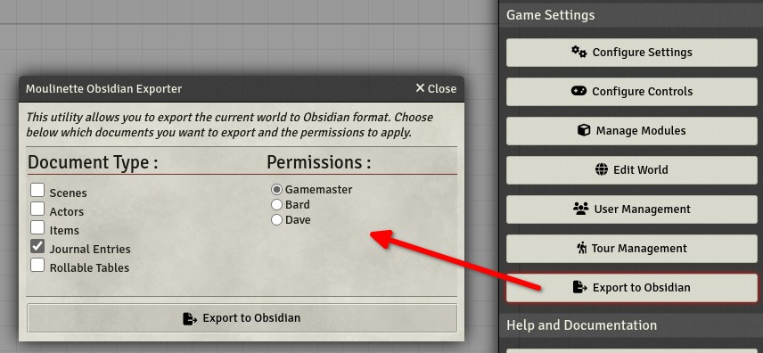
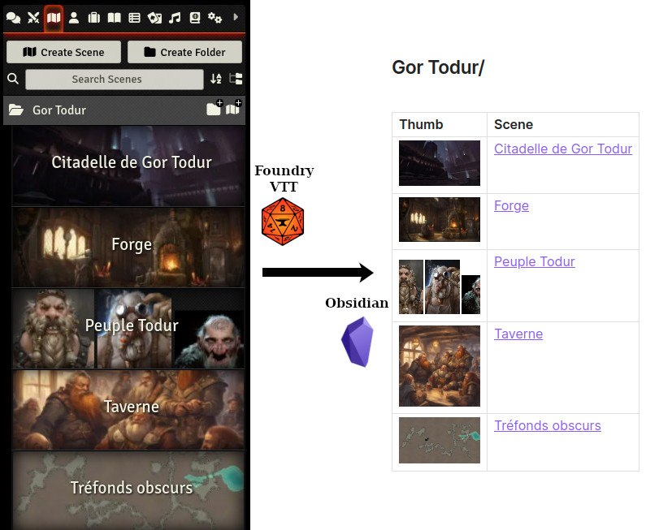
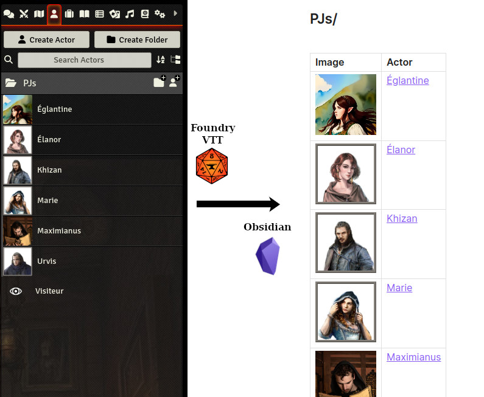
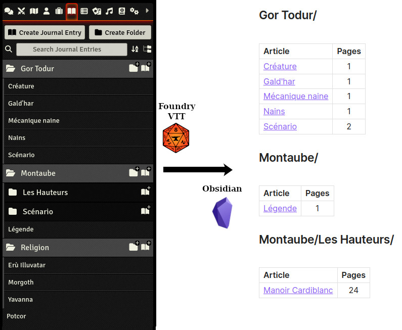

# Moulinette Obsidian

See [www.moulinette.cloud](https://www.moulinette.cloud) website.

Moulinette Obsidian is a [FoundryVTT](https://foundryvtt.com/) module which provides tools for integrating FVTT/Moulinette with [Obsidian](https://obsidian.md/).

Features :
* Export a world to [Obsidian](https://obsidian.md/)

| Types | Supported |
| ----- | :-------: |
| Scenes | :white_check_mark: |
| Actors | :white_check_mark: |
| Items | :white_check_mark: |
| Articles | :white_check_mark: | 
| Card Stacks | :x: |
| Rollable Tables | :white_check_mark: |
| Playlists | :x: |
| Compendiums | :x: |

## <a name="howto"/>How To

### Export a world to Obsidian

In FoundryVTT :
* Install and enable the module
* Under "Game Settings" click on button "Export to Obsidian"
* Check all document types you'd like to export
* Select the user whose permissions will determine the content to be exported

In Obsidian :
* Create a new Vault from the following folder : `<FVTT_HOME>/Data/moulinette-obsidian/<your-world>`
* If the vault already existed, you might have to execute `Reload app without saving` to refresh the view after the export

### Example : Scenes

### Example : Actors

### Example : Notes

## <a name="install"/>Install the module

To **install** the module from FoundryVTT:
1. Start FVTT and browse to the Game Modules tab in the Configuration and Setup menu
2. Search for "Moulinette Obsidian" and click install

To **manually install** the module (not recommended), follow these instructions:
1. Start FVTT and browse to the Game Modules tab in the Configuration and Setup menu
2. Select the Install Module button and enter the following URL: https://raw.githubusercontent.com/svenwerlen/moulinette-obsidian/master/module.json
3. Click Install and wait for installation to complete 

## <a name="support"/>Support me on Patreon

If you like my work and want to support me, consider subscribing to Moulinette!

* Recommended: [Moulinette on Stripe](https://assets.moulinette.cloud/pricing) (requires Patreon authentication)
* Or: [Moulinette on Patreon](https://www.patreon.com/moulinette)

You can also join [Moulinette Discord](https://discord.gg/xg3dcMQfP2)
